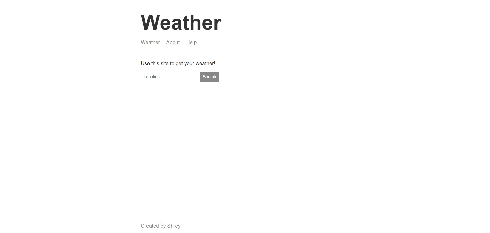
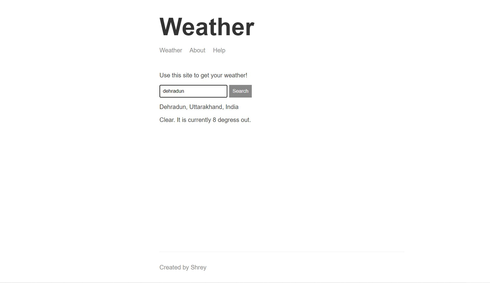

# whatsthetemp
Its a weather app
 
 Steps to clone.
 
 Step1: Download the code.
 
 Step2: Run these command.
 
 Step3: $ npm i
 
 Step4: $ npm run dev
 
 Step5: Open web browser and go to https://localhost:3000/
 
 Step6: Enter any location to know the temp.
 
 
 
 
 for any query leave a comment.
